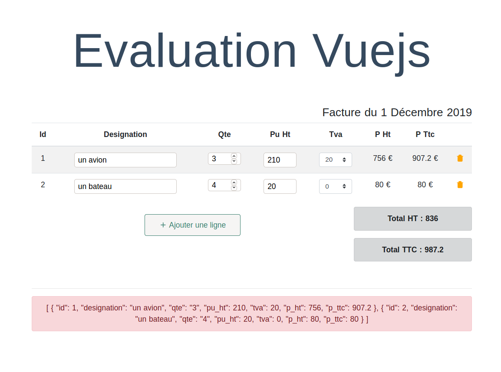

# Evaluation Vuejs

## Objectif : réaliser le formulaire suivant :


> Attention : tous les elements HTML doivent provenir de variables vuejs

Vous devez stocker votre tableau impérativement, pour cela 2 options :
* localstorage
* ajax

## Ajax

1. Installer le serveur :
```bash
cd server
npm install
npm run server
```

2. Lancer le serveur
```bash
cd server
npm run server
```


## API :

### URL de l'API
```javascript
const apiUri = "http://localhost:3000/";
```

### update
```javascript
fetch(apiUri + 'todo/' + id, {
	method: 'PATCH',
	headers: {
		'Accept': 'application/json',
		'Content-Type': 'application/json'
	},
	body: data
});
```

## create
```javascript
fetch(apiUri + 'todo', {
	method: 'POST',
	headers: {
		'Accept': 'application/json',
		'Content-Type': 'application/json'
	},
	body: data
});
```

## delete
```javascript
fetch(apiUri + 'todo/' + id, {
	method: "DELETE"
});
```
